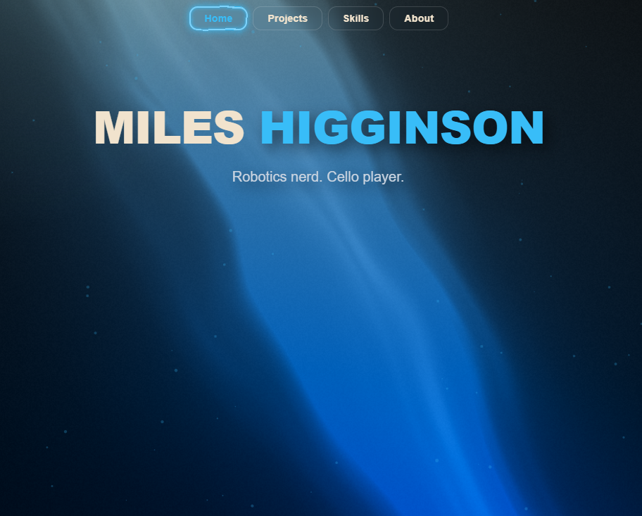

# Miles Higginson - Personal Website

Hi! This is my website! It has some projects I'm working on, skills, about me, and contact info, along with cool effects to keep it viusally interesting.

## How to access 
Click this link. Simple
[mileshigginson.com
](https://mileshigginson.com/)
## Features
This site has
* Adaptive light pillar shader
* Interactive background atmoshpere
* Electric & Magnetic buttons
* Self-typing text
* A cool, electric blue color scheme
* Interactive boxes/cards

Built with react

## Local Setup
1. Clone GitHub repo using link above.
2. npm install —legacy-peer-deps
3. npm run dev
4. Develop!

## Licence
This project is licensed under the MIT License
